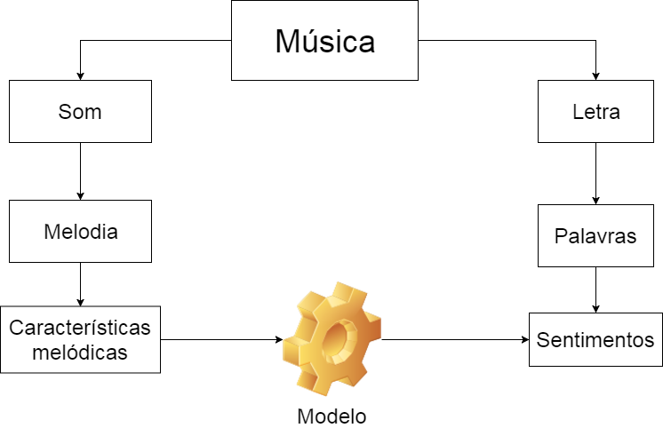
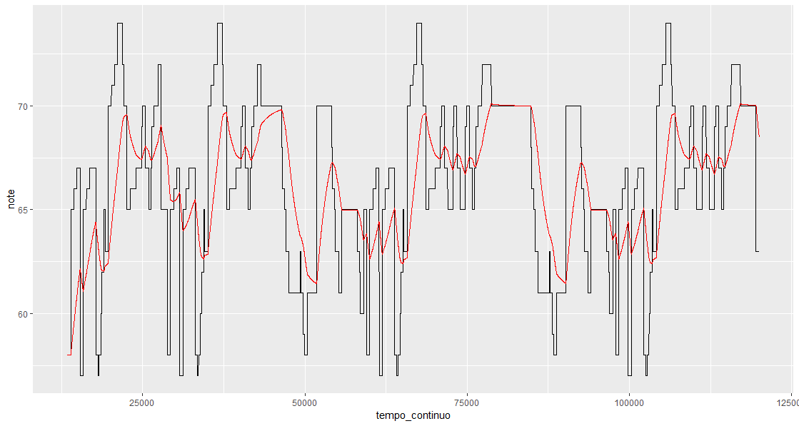

```{r}
library(tidyverse)

library(GGally)


```


```{r}

sentimentos <- read_csv("sentimentos.csv")


features <- read_csv("features_sem_coral.csv") %>% 
  filter(arquivo !="nao") %>% 
  filter(dp_duracao <1.5 ) %>% 
  filter(dp_intensidade <1 ) %>% 
  filter(volatilidade_ewma_995 < 10)


selecionados <- features %>% 
  select(volatilidade_ewma_995, 
         dp_duracao, 
         dp_intensidade,
         nome_escala,
         amplitude
         )

graus <- features %>% 
  select(
        freq_tempo_grau_0, 
        freq_tempo_grau_1, 
        freq_tempo_grau_2, 
        freq_tempo_grau_3, 
        freq_tempo_grau_4, 
        freq_tempo_grau_5, 
        freq_tempo_grau_6, 
        freq_tempo_grau_7, 
        freq_tempo_grau_8, 
        nome_escala
         ) %>% 
  rename(
        grau1 = freq_tempo_grau_1, 
        grau2 = freq_tempo_grau_2, 
        grau3 = freq_tempo_grau_3, 
        grau4 = freq_tempo_grau_4, 
        grau5 = freq_tempo_grau_5, 
        grau6 = freq_tempo_grau_6, 
        grau7 = freq_tempo_grau_7, 
        grau8 = freq_tempo_grau_8, 
        grau0 = freq_tempo_grau_0
    
  ) %>% 
  gather(grau, valor, -nome_escala)


```


## Objetivo

O objetivo é criar um modelo que consiga determinar o grau de determinados sentimentos na letra de uma música a partir de características da melodia


## Possíveis usos

- Entender quais características de uma melodia implicam em determinado sentimento 
- Entender se a relação entre características e sentimentos funciona de forma semelhante em vários gêneros
- Facilitar o trabalho de se musicar uma letra ou criar letra para uma melodia automaticamente

## Esquema



## Desafios

- Buscar as músicas e as letras
- Inferir o grau dos sentimentos dentro da letra
- Extrair a melodia principal de dentro da música
- Extrair características interessantes da melodia (feature engineering)
- Desenvolver o modelo de aprendizado estatístico que infere os sentimentos a partir das características
 
## Busca das músicas

- Músicas em formato MIDI. 

- O formato simbólico, sem questões relativas à onda sonora como timbre e ruído. Existem partituras eletrônicas também, mas existem mais midis disponíveis. 

- Zip com 110.000 músicas disponível no site https://www.reddit.com/r/WeAreTheMusicMakers/comments/3ajwe4/the_largest_midi_collection_on_the_internet/ e mais 

- Outros sites com midis

## Busca das letras

Com os midis em mãos, foram usadas duas fontes para baixar as letras:

- https://vagalume.com.br, com o uso da biblioteca vagalumeR

- https://genius.com/, com uso da biblioteca Genius

No zip, foi necessãrio separar o nome do artista e o nome da música a partir do nome do arquivo

## Inferência do grau de sentimento das letras

Método simples mas bastanet utilizado:

- As palavras são separadas

- Cada palavra é buscada em um corpus para que sejam identificados os sentimentos evocados por ela

- São contados número de vezes em que um sentimento aparece

- No nosso caso, forçamos que $positivo + negativo = 1$ e $raiva + ansiedade + nojo + medo + alegria + tristeza + surpresa + confiança = 1$  


## Melodia principal de dentro do MIDI

- usada a bliblioteca tuneR

- A melodia normalmente está na track 4, mas nem sempre

- Sempre que havia alguma indicação inequívoca em outra track, foi usada: "voice", "melody", "lead voice" etc.

- Informações na track: as notas com início, duração e intensidade


## Características da melodia

- Escala (modo): 1 var discreta

- Frequência em tempo e unidade dos graus da escala (e fora da escala): 18 var contínuas

- Frequência dos intervalos: 162 var contínuas

- Desvio-padrão da duracão das notas

- Desvio-padrão da intensidade das notas normalizado pela média

- Amplitude das notas normalizado pela média

- "volatilidade" da melodia: $Média(Abs(Nota_t - Ewma_t)$, onde $Ewma_t = (1 - \alpha) Nota_t + \alpha \cdot Ewma_{t-1}$, dois valores de $\alpha$

## Volatilidade da melodia




## Características da melodia

```{r message=FALSE, warning=FALSE, paged.print=FALSE, echo=FALSE}

ggpairs(selecionados) +
  theme(
    
    strip.text = element_text(size = 6),
    axis.text = element_text(size = 4)
    
  )
  

```


## Características do Grau


```{r message=FALSE, warning=FALSE, paged.print=FALSE, echo=FALSE}


ggplot(graus %>% filter(nome_escala %in% c("maior", "menor") )) +
  geom_density(aes(x = valor) ) +
  facet_grid(grau ~ nome_escala )


```


## Modelo de aprendizado estatístico

- Depois de toda a preparação feita anteriormente, sobraram 625 músicas com dados completos....

- Foram separados 80% dos dados para treinamento e validação.

- Os modelos foram treinados e avaliados no esquema de cross validation 

- Foram rodados os seguintes modelos: regressão linear, floresta aleatória, redes neurais, generalized additive model. Target: sentimento positivo. Nenhum se saiu melhor do que um modelo do mesmo tipo treinado e avaliado em dados aleatórios


## Possibilidades de melhora do modelo


- Considerar a hamornia, a partir dos acordes

- Outras features?

- Analisar com mais detalhes as features que foram extraídas das melodias para ver se fazem sentido

- Considerar apenas letras que têm muitas palavras reconhecidas? 

- 


